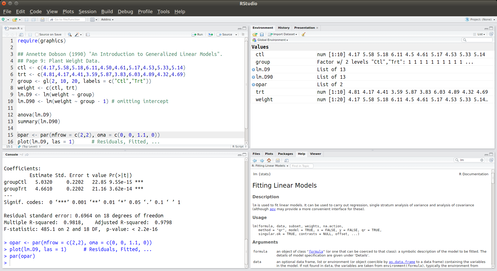
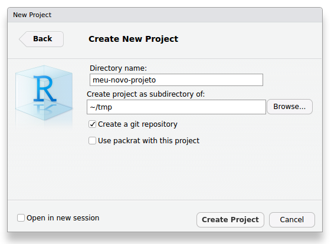
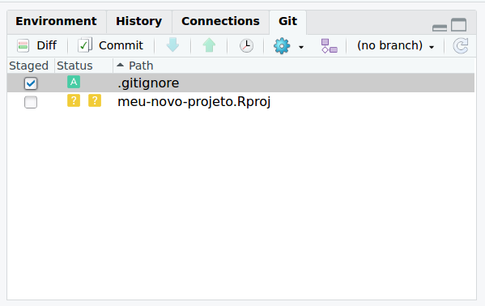
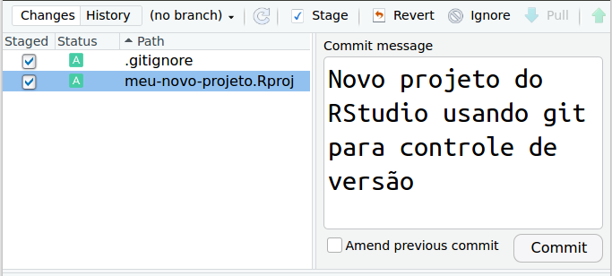

# Ambiente de Análise de Dados

A modelagem geoestatística do ambiente se dá, fundamentalmente, pelo uso de computadores. Isso significa que necessitamos, obrigatoriamente, de um ambiente de análise de dados -- um programa de computador -- especializado para tal tarefa. É por meio desse programa de computador que daremos instruções ao nosso computador para que ele desempenhe determinada tarefa como, por exemplo, computar estatísticas descritivas de um conjunto de dados ou produzir um gráfico relacionando uma variável dependente $y$ com uma variável independente $x$.

São inúmeros os programas de computador disponíveis para o desenvolvimento de estudos de modelagem geoestatística do ambiente. Para aprender e potencialmente dominar o uso de qualquer desses programas de computador, será necessário que você aprenda a sua [linguagem][linguagem]. A linguagem de um programa de computador é um sistema de signos convencionados que serve para a comunicação com o computador. Nesse caso, a comunicação com o computador se dá via uso de uma interface de linha de comando ([CLI][cli], do inglês *command-line interface*), ou seja, via emissão de comandos sob a forma de sucessivas linhas de texto, as chamadas linhas de comando.

[linguagem]: https://pt.wikipedia.org/wiki/Linguagem
[cli]: https://pt.wikipedia.org/wiki/Linha_de_comandos

Uma das grandes vantagens dos programas de computador que utilizam comandos de texto -- ao invés de botões e caixas de diálogo -- é o fato de permitirem ao usuário fazer adaptações metodológicas, desenvolver novos métodos e expandir sua caixa de ferramentas analíticas para além daquilo que já estiver implementado no programa de computador. Além disso, a documentação de todos os passos da modelagem fica mais fácil, haja vista que todos os comandos emitidos ficam registrados. Isso permite que erros possam ser facilmente identificados e corrigidos. Ou ainda, que um estudo possa ser inteiramente [reproduzido][reprodutibilidade], tanto pelo mesmo pesquisador como por qualquer outro pesquisador trabalhando independentemente em qualquer lugar do planeta. Dentre os ambientes de análise de dados que utilizaremos ao longo desse curso que usam uma interface de linha de comando, o principal deles é o R.

[reprodutibilidade]: https://pt.wikipedia.org/wiki/Reprodutibilidade

## R & RStudio

O R é uma linguagem de programação e um ambiente de análises estatísticas e gráficas gratuito. Sua origem data de 1995, quando os pesquisadores [Robert Gentleman][robert-gentleman] e [Ross Ihaka][ross-ihaka] iniciaram o projeto de seu desenvolvimento no Departamento de Estatística da Universidade de Auckland na Nova Zelândia. Baseado na linguagem de programação e ambiente estatístico [S][s], desenvolvido por [John Chambers][john-chambers] e colegas no [Bell Laboratories][bell-laboratories]. Hoje o R é um software livre mantido e desenvolvido pelo [R Core Team][r-core-team], disponível gratuitamente para qualquer interessado em utilizá-lo, modificá-lo e redistribuí-lo.

[bell-laboratories]: https://en.wikipedia.org/wiki/Bell_Labs
[ross-ihaka]: https://en.wikipedia.org/wiki/Ross_Ihaka
[robert-gentleman]: https://en.wikipedia.org/wiki/Robert_Gentleman_(statistician)
[s]: https://en.wikipedia.org/wiki/S_(programming_language)
[john-chambers]: https://en.wikipedia.org/wiki/John_Chambers_(statistician)
[r-core-team]: https://www.r-project.org/contributors.html

O R fornece uma ampla variedade de técnicas estatísticas, incluindo análises univariadas, bivariadas e multivariadas, desde as mais simples até as mais complexas, como análises descritivas, análise de variância e testes de médias, análise de agrupamento e de componentes principais, análise de séries temporais, modelagem geoestatísticas e muito, muito mais. O R ainda fornece uma série de ferramentas para produção de diversos tipos gráficos com qualidade para publicação. Todas essas técnicas e ferramentas, além de amplamente documentadas, são customizáveis e extensíveis. Assim, além de dispor das técnicas já incluídas no ambiente R, o usuário pode utilizar-se da linguagem R para criar suas próprias técnicas e, em seguida, torná-las disponíveis para uso pela comunidade científica na forma de pacotes.

Para instalar R, será preciso acessar a página do projeto na Internet (http://www.r-project.org/). O procedimento de instalação do R depende do sistema operacional ([OS][os], do inglês *operating system*) de seu computador:

[os]: https://en.wikipedia.org/wiki/Operating_system

* Linux: https://cloud.r-project.org/bin/linux/
* (Mac) OS X: https://cloud.r-project.org/bin/macosx/
* Windows: https://cloud.r-project.org/bin/windows/base/

Note que uma grande quantidade de informação, muito além do que se busca incluir nesse material, pode ser encontrada na página do projeto. Lá estão disponíveis diversos manuais de uso (`Documentation > Munuals`), bem como livros (`Documentation > Books`) e artigos publicados na revista do projeto (`Documentation > The R Journal`). Há ainda uma página com respostas às perguntas mais frequentes (`Documentation > FAQs`) e uma página inteira explicando como é possível conseguir ajuda antes de recorrer diretamente a terceiros (`Help With R > Getting Help`).

Instalado o R, agora é a hora de instalar o RStudio. A última versão do instalador do RStudio para o seu OS pode ser descarregada do seguinte endereço na Internet: https://www.rstudio.com/products/rstudio/download/. Depois de instalado, inicie o RStudio. Ele deve se parecer mais ou menos como mostra a Figura \@ref(fig:rstudio-snapshot).

```{r rstudio-snapshot, echo=FALSE, fig.cap="RStudio -- ambiente de desenvolvimento integrado para R (em sua versão para Linux).", out.width='50%', fig.align='center'}

```

Você deve ter notado que o RStudio é composto por quatro grandes painéis retangulares, cada um contendo conteúdo específico. Grosso modo, o painel superior direito mostra informações diversas sobre a atual sessão de trabalho, sendo geralmente pouco utilizado. Já o painel inferior direito serve à visualização de gráficos e páginas de ajuda do R, o que o faz ser bastante utilizado. O painel superior esquerdo é aquele utilizado para a programação em R, ou seja, aquele onde as linhas de comando utilizadas para a análise dos dados são editadas. Esse painel é aquele onde ocupamos a maior parte do tempo. Por fim, o painel inferior esquerdo corresponde à interface de linha de comando (CLI), o console do R. É ali que as linhas de comando editadas no painel superior esquerdo deve ser emitidas para que a "mágica" aconteça. Para isso você pode, no editor, posicionar o cursor sobre a linha de código fonte que deseja que seja emitida e pressionar, simultaneamente, as teclas `Ctrl` e `Enter`. Alternativamente, para emitir um bloco de linhas de comando, você deve selecioná-lo por completo e então pressionar as teclas `Ctrl` e `Enter`.

# Gerenciamento de Código Fonte

O controle de versão é uma prática de fundamental importância para o gerenciamento ao longo do tempo de arquivos em geral, dentre eles arquivos contendo código fonte. Um sistema de controle de versão registra todas as mudança feitas no código fonte. Assim, quando cometemos algum erro ou desenvolvemos o código fonte em uma direção que mais tarde se mostra equivocada, podemos olhar para as versões anteriores do código fonte até encontrarmos o ponto em que erramos ou o momento no qual tomamos aquela direção equivocada. Basta então recuperar aquela versão do código fonte e continuar o seu desenvolvimento dali em diante.

A estratégia de controle de versão mais comumente usada consiste em manter uma estrutura de arquivos mais ou menos com a seguinte:

    meu-novo-projeto/
    |- code/
    |  |- script01.R
    |  |- script01-modificado.R
    |  |- script02.R
    |  |- script02-revisado.R
    |  |- script02-revisado-novo.R
    |  |- script-final.R
    |  |- script-final-final.R

Segundo a estratégia acima, cada arquivo é nomeado de acordo com o estágio de desenvolvimento e fazendo uma referência generalista ao tipo de alteração feita. Isso pode ser eficiente quando fazemos poucas alterações ou então alterações pouco significativas. Contudo, à medida que aumenta a complexidade de nosso projeto, maior será o número de edições no código fonte e, também, maior será a complexidade delas. Felizmente existem alternativas bastante mais eficientes do que aquela mostrada acima. Na verdade, um bom sistema de controle de versão dará conta do registro e organização das diferentes versões do código fonte de maneira completamente automática.

## git & GitHub

Um dos sistemas mais populares de gerenciamento e controle de versão de código fonte é o [git][git]. Comparado aos outros sistemas de controle de versão, uma das grandes vantagens do git é o fato de ser de fácil instalação e poder ser utilizado localmente, sem necessidade de conexão permanente a um servidor remoto. Isso é possível porque o git  realiza todas as operações de gerenciamento do código fonte localmente. Basta submeter (em inglês, *commit*) ao git toda e qualquer edição importante, associando à ela uma mensagem descritiva. Além da importância para o uso pessoal, essa funcionalidade também é muito importante quando temos acesso limitado ou intermitente ao [repositório remoto][github] onde publicamos e compartilhamos o código fonte (por exemplo, por limitada conexão à Internet).

[git]: https://git-scm.com/
[github]: https://github.com/

Outra importante funcionalidade do git -- comparado aos demais sistemas de controle de versão -- é a capacidade de gerenciar diferentes "ramos" (em inglês, *branches*) de desenvolvimento do código fonte. Assim, há sempre um ramo principal, com a versão mais estável do código fonte, e ramos secundários com os quais podemos fazer testes diversos, tudo isso sem tocar na versão estável do código fonte. Caso os resultados de um ramo de desenvolvimento do código fonte se mostrarem interessantes e julgarmos que vale a pena adicioná-los à versão estável do código fonte, basta fazer a fusão (em inglês, *merge*) dos dois ramos -- ou simplesmente deletar o ramo de teste caso seus resultados se mostrem inúteis. Na prática, isso elimina a necessidade de criação de diferentes arquivos, tanto quando trabalhamos sozinhos, como quando trabalhamos em grupo.

Passemos então à instalação e uso do git!

Para verificar se você já tem o git instalado em seu computador, acesse o Terminal -- painel esquerdo inferior do RStudio -- e emita as linhas de comando abaixo conforme o seu sistema operacional:

```{bash, eval=FALSE}
# Verificação da instalação do git
which git # Linux & Mac
where git # Windows
git --version
```

Se o git estiver instalado, o primeiro comando (`which git`, em Linux e Mac, ou `where git`, em Windows) deverá retornar o caminho para o diretório onde os arquivos do git estão localizados -- por exemplo, `/usr/bin/git` --, enquanto o segundo comando mostra a versão do git que está instalada -- por exemplo, `git version 2.7.4`. Caso você não tenha o git instalado em seu computador, vá até o endereço https://git-scm.com/downloads e descarregue o instalador e estude as diretrizes de instalação para o seu sistema operacional.

Depois de instalado o git, precisamos fazer a sua configuração. Trata-se de informar seu nome e endereço de e-mail para o git. Isso é necessário porque o git registra esses dados à cada edição submetida ao controle de versão. Apesar da pequena utilidade quando trabalhamos sozinhos, essa prática é da maior importância quando duas ou mais pessoas colaboram na edição do código fonte, permitindo identificar quem fez cada alteração. Para configurar o seu nome e endereço de e-mail no git, acesse o Terminal -- painel esquerdo inferior do RStudio -- e emita as duas linhas de comando abaixo substituindo com seus dados os campos pertinentes:

```{bash, eval=FALSE}
# Configuração do git
git config --global user.name 'Seu Nome aqui'
git config --global user.email 'seu@email.aqui'
```

A maneira mais fácil de utilizar o git para o gerenciamento e controle de versão do código fonte -- e demais dados e documentos -- que produzimos em nossos projetos é via RStudio. Para isso, ao criar um novo projeto no RStudio usando um novo diretório (`Files > New Project > New Directory > New Project`), devemos habilitar a opção `Create a git repository`:

```{r rstudio-novo-projeto-git, echo=FALSE, fig.cap="Novo projeto do RStudio usando git para controle de versão.", out.width='50%', fig.align='center'}

```

O diretório do novo projeto do RStudio deverá conter uma estrutura com a mostrada abaixo (pode ser preciso habilitar a visualização de arquivos ocultos em seu gerenciador de arquivos):

    meu-novo-projeto/
    |- .git/
    |- .Rproj.user/
    |- meu-novo-projeto.Rproj
    |- .gitignore

Tando o subdiretório `.Rproj.user` como o arquivo `meu-novo-projeto.Rproj` já foram descritos anteriormente. O que temos de novidade aqui são o subdiretório `.git` e o arquivo `.gitignore`. O subdiretório `.git` consiste no repositório local onde as edições submetidas ao git são registradas. Já o arquivo `.gitignore` serve para identificar os arquivos e subdiretórios que devem ser, como o próprio nome sugere, ignorados pelo git. É o caso, por exemplo, de um subdiretório temporário criado para armazenar produtos do projeto que podem mudar a cada instante e serem descartados a qualquer momento.

Agora, no Terminal, emita o comando `git status` para acessar as informações sobre o estado atual do git:

```{bash, eval=FALSE}
# Verificação do estado atual do git
git status
```

O resultado impresso no terminal deve ser aproximadamente o seguinte:

    On branch master
    
    Initial commit
    
    Untracked files:
      (use "git add <file>..." to include in what will be committed)
    
            .gitignore
            meu-novo-projeto.Rproj

    nothing added to commit but untracked files present (use "git add" to track)

A primeira informação é de que estamos operando no ramo `master` do git. Ademais, temos a informação de que existem dois arquivos não monitorados pelo git: `.gitignore` e `meu-novo-projeto.Rproj`. Para iniciar o monitoramento desses arquivos, acessamos a aba `Git` no painel superior direito to RStudio e habilitamos as caixas sob o item `Staged`, o que fará o símbolo sob o item `Status` passar de um sinal de interrogoção amarelo para um `A` verde (adicionar, do inglês *add*).

```{r rstudio-git-add, echo=FALSE, fig.cap="Adicionando arquivos ao monitoramento do git.", out.width='50%', fig.align='center'}

```

Em seguida acessamos o item `Commit` e, na janela que abrir, inserirmos uma mensagem (`Commit message`) descrevendo o tipo de edição feita no projeto. Nesse caso, a edição consistiu na criação de um novo projeto do RStudio usando git para controle de versão (Figura \@ref(fig:rstudio-git-commit)). Feito isso basta pressionar o botão `Commit`.

```{r rstudio-git-commit, echo=FALSE, fig.cap="Submissão de edição ao git.", out.width='50%', fig.align='center'}

```
